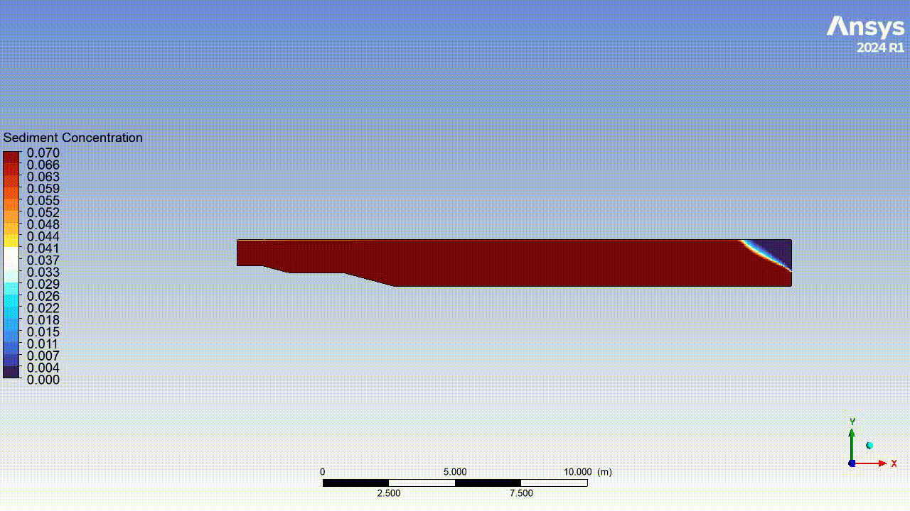
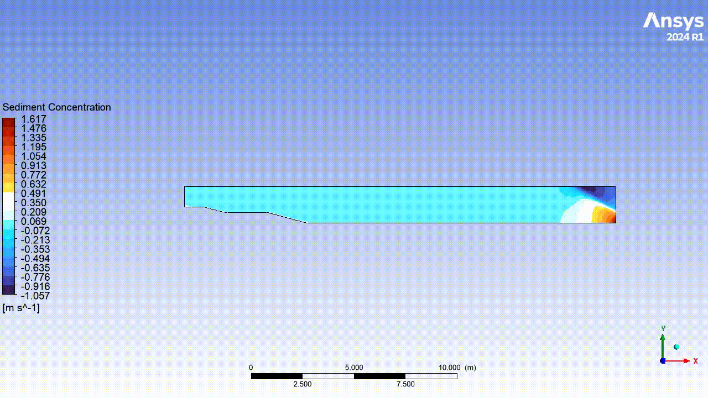

# Turbidity Current (2D) in ANSYS Fluent — Mixture Model

> A minimal turbidity-current simulation (water + dilute sediment) with depth-averaged run-out analysis. Built for clarity in the topic.


---

## Overview

This repository demonstrates a **2D turbidity current** in a water-filled channel with a shaped seabed. A **finite sediment pulse** enters at the left, collapses under gravity, and propagates as a density current along the bed. Intended to compute the **front position** and the **run-out distance** using a **depth-averaged** concentration. 

> but

**Full run-out was not captured, the plume structure and sediment settling behaviour were visible and consistent with expectations. Requires a better domain, finer mesh, and better boundary conditions**

- **Solver:** ANSYS **Fluent** (Pressure-based, transient)  
- **Model:** **Mixture** multiphase; Primary = water, Secondary = sediment (dilute)  
- **Dimensionality:** 2D (planar)  
- **Goal metrics:** front trajectory, run-out, qualitative structure (plume/core, shear layer)
---

## Geometry & Mesh

- Domain: 2D channel with a sloped seabed (rigid lid at top).
- All dimensions in **meters**.
- Mesh: quads; refine near the bed (edge **bias** in 2D).

### 📐 Mesh Statistics

| Metric          | Value   |
|-----------------|---------|
| Nodes           | 31,500  |
| Elements        | 30,756  |
| Corner Nodes    | 31,500  |
| Shell Elements  | 30,756  |
| QuadShell4      | 30,756  |

- **Element type:** Quad (2D shell elements)  
- **Total elements:** ~30k → coarse but sufficient for a first test  
- **Notes:** Mesh is globally uniform; (Like mentioned earlier, refinement near the bed would improve resolution of shear layers and near-wall transport)  
---

## Physics Setup (Fluent)

- **General:** Pressure-Based, **Transient**, 2D, Gravity ON (Y = −9.81 m/s²)
- **Operating Conditions:** Variable-Density → **User-Defined Operating Density = 1000 kg/m³**
- **Models**
  - **Viscous:** *Realizable k–ε*, Standard Wall Functions
  - **Multiphase:** **Mixture**
    - Primary: `water-liquid`
    - Secondary: `sediment` (custom material)
    - Drag: **Schiller–Naumann**
    
- **Materials**
  - `water-liquid`: ρ = 1000 kg/m³, μ = 1e−3 Pa·s
  - `sediment`: ρ = 2650 kg/m³ (no viscosity), **diameter = 1e−4 m** (100 µm)

**Boundaries**
- **inlet_left (Velocity Inlet):**  
  - Velocity: `U_in` (e.g., 0.10–0.20 m/s)  
  - Turbulence: 5% intensity  
  - **Sediment vol. fraction** (Phase-2) = **0.01** (for the pulse)
- **outlet_right (Pressure Outlet):** Backflow sediment = **0**
- **top_wall, bed_wall:** no-slip walls (no mass exchange in v1)

---

## Initial & Transient Controls

- **Initialization:** **Hybrid Initialization** → domain fills with water; sediment = 0.
- **Pulse plan:** inject sediment for **Tₚ** seconds, then switch to clear water.
  - Example profile:
    ```
    t=0–5 s:  α_s,in = 0.01 (1%)
    t>5 s:    α_s,in = 0.00
    ```
- **Time stepping**
  - **Δt** = 0.002–0.005 s
  - **Iterations/step:** 40–60 (use residual targets to exit early)
  - **Discretization:** First-Order Upwind
  - **Coupling:** PISO


##  Post-Processing & Plots


### Core plots
- **Sediment volume fraction (Phase-2 α)**  
  _GOAL:_ plume body & front(ish)


- **Velocity magnitude**  
  _GOAL:_ frontal jet(ish), shear layer intensity

---
##  Limitations of this first solution

- **Mesh resolution:** relatively coarse, especially near the bed. Acceptable for a first run-out estimate, but finer grids would better capture shear layers, eddies, and near-bed transport.  
- **Domain size:** too short to capture the full run-out — the front reaches the outlet early. A longer domain is needed for proper run-out measurement.   
- **Inlet definition:** imposed as a simple step pulse; smoother profiles or better patching in a larger domain would represent realistic releases more faithfully.  
- **Near-wall modelling:** simplified with no-slip walls; higher resolution or improved near-wall treatment would give more accurate shear stresses, deposition, and entrainment.  
- **Sediment physics:** treated as a single dilute phase; no stratification or multiple size classes yet.  

---


##  Possible Expansions (what I’d do with more compute)

- **2D vs 3D models:** extend from simple 2D depth-averaged runs to full fully resolved 3D runs to capture lateral spreading and structure–current interactions.  
- **Higher resolution near the bed:** refine grids at the seabed to better resolve shear layers, eddies, and near-bed transport.  
- **Sediment processes:** include settling, deposition, and entrainment to track how currents evolve and fade.  
- **Flow structures:** capture eddies that influence mixing and front speed.  
- **Offshore structures:** add simplified foundations (e.g. monopiles, cables) and use fluid–structure interaction (FSI) to assess loads and risks. 

---

